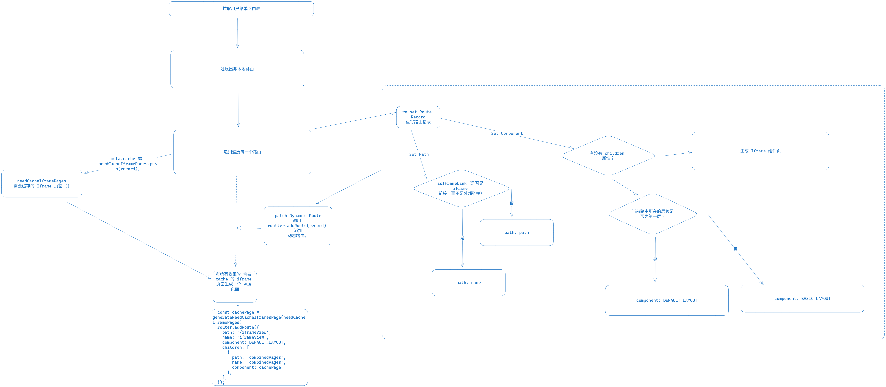
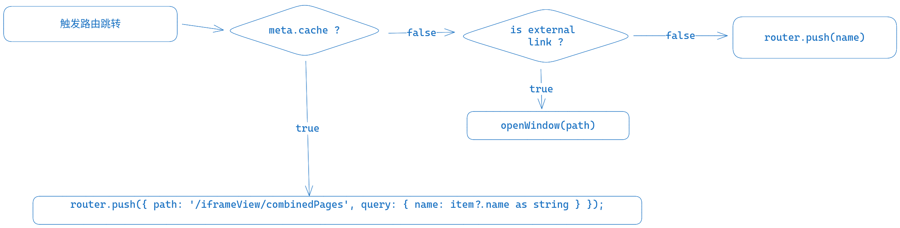

> 项目结构设计自:
>
> https://arco.design/vue/docs/start
>
> 有相关问题可以参考这里

## 前端设计

[toc]

### 目录结构设计

```bash
├── README.md
├── package.json
├── index.html
├── src
│   ├── api  # 请求接口
│   ├── assets  # 静态资源
│          └── style 全局样式
│   ├── components  # 通用业务组件
│   ├── config  # 全局配置(包含echarts主题)
│          └── settings.json  # 配置文件
│   ├── directives # 指令集（如需，可自行补充）
│   ├── filters # 过滤器（如需，可自行补充）
│   ├── hooks # 全局hooks
│   ├── layout  # 布局
│   ├── locale  # 国际化语言包
│   ├── mock  # 模拟数据
│   ├── views  # 页面模板
│   ├── router # 路由配置
│   ├── store  # 状态管理中心
│   ├── types  # Typescript 类型
│   └── utils  # 工具库
│   └── App.vue  # 视图入口
│   └── main.ts  # 入口文件
└── tsconfig.json
```


### 布局 (略)


### 路由与菜单

#### 路由

首先，需要先了解一下路由表的配置。基本的路由配置请参阅 [Vue-Router](https://router.vuejs.org/) 官方文档

```vue
// 在本例子中，页面最终路径为 /dashboard/workplace
export default {
 path: 'dashboard',
 name: 'dashboard', // 路由名称
 component: () => import('@/views/dashboard/index.vue'),
 meta: {
   locale: 'menu.dashboard',
   requiresAuth: true,
   icon: 'icon-dashboard',
 },
 children: [
   {
     path: 'workplace',
     name: 'workplace',
     component: () => import('@/views/dashboard/workplace/index.vue'),
     meta: {
       locale: 'menu.dashboard.workplace',
       requiresAuth: true,
       roles: ['admin'],
       hideInMenu: false,
     },
   },
 ],
};
```

路由 `Meta` 元信息

| 参数名             | 说明                                                         | 类型     | 默认值 |
| :----------------- | :----------------------------------------------------------- | :------- | :----- |
| roles              | 配置能访问该页面的角色，如果不匹配，则会被禁止访问该路由页面 | string[] | -      |
| requiresAuth       | 是否需要登录鉴权                                             | boolean  | false  |
| icon               | 菜单配置icon                                                 | string   | -      |
| locale             | 一级菜单名（语言包键名）                                     | string   | -      |
| hideInMenu         | 是否在左侧菜单中隐藏该项                                     | boolean  | -      |
| hideChildrenInMenu | 强制在左侧菜单中显示单项                                     | boolean  | -      |
| activeMenu         | 高亮设置的菜单项                                             | string   | -      |
| order              | 排序路由菜单项。如果设置该值，值越高，越靠前                 | number   | -      |
| noAffix            | 如果设置为true，标签将不会添加到tab-bar中                    | boolean  | -      |
| ignoreCache        | 如果设置为true页面将不会被缓存                               | boolean  | -      |

#### 菜单

前端菜单生成过程：

- 在Store中增加api请求的 action，用于获取服务端的路由配置。
- 发起请求，将服务端的路由配置结果存储在Store中。
- 通过 appRoute 计算属性，得到带有路由信息的路由树。
- 使用上一步获取的路由信息进行权限过滤，生成用于渲染的 菜单树。
- 通过 渲染 菜单树，递归生成菜单。


#### 新增一个菜单项的步骤

了解完路由和菜单的生成，就可以上手配置一个新的菜单项了，以新增一个监控页面为例。

- 在 views/dashboard 中新增一个 monitor 文件夹，并在其中新增 index.vue

```vue
<script lang="ts" setup><script>
```

- 在路由表中新增监控页的路由配置

```diff
export default {
  path: 'dashboard',
  name: 'dashboard',
  component: () => import('@/views/dashboard/index.vue'),
  meta: {
    locale: 'menu.dashboard',
    requiresAuth: true,
    icon: 'icon-dashboard',
  },
  children: [
    {
      path: 'workplace',
      name: 'workplace',
      component: () => import('@/views/dashboard/workplace/index.vue'),
      meta: {
        locale: 'menu.dashboard.workplace',
        requiresAuth: true,
      },
    },
+   {
+     path: 'monitor',
+     name: 'monitor',
+     component: () => import('@/views/dashboard/monitor/index.vue'),
+     meta: {
+       locale: 'menu.dashboard.monitor',
+       requiresAuth: true,
+       roles: ['admin'],
+     },
+   },
  ],
};
```

- 在语言包中新增菜单名

以下是中文语言包。

```diff
// src/locale/zh-CN.ts
export default {
  'menu.dashboard': '仪表盘',
  'menu.dashboard.workplace': '工作台',
+ 'menu.dashboard.monitor': '实时监控',
}
```

### 页面渲染流程设计(待定)

基本的渲染逻辑:

iframe 的渲染, 有两种,实现方式, 一种是 将每个 url 对应的动态生成一个嵌套有 iframe 的页面, 单独作为一个页面存在. 

**优点:** 这种方式的优点在于简单, 易于实现, 不需要过多的包装, 拦截等操作

**缺点:** `iframe` 内容是无法被缓存的, 意味着每当切换路由 / tab, 页面都会重新刷新. 

<video src="videos/pure-switch.mp4"></video>


"缓存" iframe 如何实现? 

目前为止,  没有办法能够将iframe 的内容,进行缓存, 比较曲线救国的方式, 是利用  `v-show` 的方式,将非匹配当前路由页面 隐藏.

**优点: ** 这种方式,能够实现页面的 "缓存" 效果

**缺点:** 采用这种方式, 有诸多有待进一步研究解决的问题, 例如, 标签页如何处理 ? 如果就需要强制刷新该怎么支持?, 多个页面全部在同一个组件 上下文中存在, 性能上是否存在问题? 嵌套子路由是否好处理维护?

<video src="videos/v-show.mp4"></video>


**结合渲染方案， 同时支持**

默认全部iframe 路由缓存， 当路由表 `meta.ignoreCache` 为 `true` 时， 将不会走缓存逻辑。

> `meta.ignoreCache` 在普通vue组件页面中的表现将是 禁止`keep-alive`。

路由构建逻辑




路由跳转逻辑




### 权限控制

中后台常见的前端权限控制大概可概括为以下场景：

1. 菜单权限控制，针对**某个菜单/页面**进行权限管理，有则能看到此页面，否则将展示无权限。
2. **针对某页面中的某触发器**进行权限管理，例如对列表页的某一条数据进行删除操作。有权限情况下则展示删除按钮。

#### 菜单权限管理

针对菜单及路由权限控制，可以在 路由配置项 中，对某项增加 `roles` 参数即可。

```ts
export default {
  path: 'dashboard',
  name: 'dashboard',
  component: () => import('@/views/dashboard/index.vue'),
  meta: {
    locale: 'menu.dashboard',
    requiresAuth: true,
    icon: 'icon-dashboard',
  },
  children: [
    {
      path: 'workplace',
      name: 'workplace',
      component: () => import('@/views/dashboard/workplace/index.vue'),
      meta: {
        locale: 'menu.dashboard.workplace',
        requiresAuth: true,
        roles: ['*'], // * 表示通配权限。提示：为了少写点代码，也可以不定义这个字段。
      },
    },
    {
      path: 'monitor',
      name: 'monitor',
      component: () => import('@/views/dashboard/monitor/index.vue'),
      meta: {
        locale: 'menu.dashboard.monitor',
        requiresAuth: true,
        roles: ['admin'],
      },
    },
  ],
};
```


#### 某按钮权限管理

可在组件或者原生元素上使用 `v-permission` 指令, 如下，将有权限的角色类型放置在数组中即可。

```vue
<button v-permission="['admin']">删除</button>

<a-button v-permission="['user']">删除</a-button>
```


#### 实现

##### 路由权限管理

对应的权限管理钩子。可以自定义业务的权限需求。

```ts
#src/hooks/permission.ts

import { RouteLocationNormalized, RouteRecordRaw } from 'vue-router';
import { useUserStore } from '@/store';

export default function usePermission() {
  const userStore = useUserStore();
  return {
    accessRouter(route: RouteLocationNormalized | RouteRecordRaw) { // 判断当前用户是否有该路由的权限
      return (
        !route.meta?.requiresAuth ||
        !route.meta?.roles ||
        route.meta?.roles?.includes('*') ||
        route.meta?.roles?.includes(userStore.role)
      );
    },
    // You can add any rules you want
  };
}
```

设置路由守卫，在路由守卫中对用户的页面进出进行管理。例如 当前用户是否已经登录、当前用户是否有页面权限。

```ts
router.beforeEach(async (to, from, next) => {
  const userStore = useUserStore();
  async function crossroads() {
    const Permission = usePermission();
    if (Permission.accessRouter(to)) await next();
    else {
      const destination = Permission.findFirstPermissionRoute(
        appRoutes,
        userStore.role
      ) || {
        name: 'notFound',
      }; // 前往首个有权限的页面或者404。
      await next(destination);
    }
  }
  if (isLogin()) { // 判读用户是否登录
    if (userStore.role) { // 有角色信息表示当前用户已经登录且获取过用户信息
      crossroads();
    } else {
      try {
        await userStore.info(); // 获取用户角色信息后再进行后续跳转处理
        crossroads();
      } catch (error) {
        next({
          name: 'login',
          query: {
            redirect: to.name,
            ...to.query,
          } as LocationQueryRaw,
        });
      }
    }
  } else {
    // 如果未登录则重定向到登录页面
    if (to.name === 'login') {
      next();
      return;
    }
    next({
      name: 'login',
      query: {
        redirect: to.name,
        ...to.query,
      } as LocationQueryRaw,
    });
  }
});
```

##### 自定义权限指令

```ts
import { DirectiveBinding } from 'vue';
import { useUserStore } from '@/store';

function checkPermission(el: HTMLElement, binding: DirectiveBinding) {
  const { value } = binding;
  const userStore = useUserStore();
  const { role } = userStore;

  if (Array.isArray(value)) {
    if (value.length > 0) {
      const permissionValues = value;
      // 对当前用户的角色权限和传入指令的权限类型进行比对。如果当前用户无权限则会执行节点删除操作。
      const hasPermission = permissionValues.includes(role);
      if (!hasPermission && el.parentNode) {
        el.parentNode.removeChild(el);
      }
    }
  } else {
    throw new Error(`need roles! Like v-permission="['admin','user']"`);
  }
}

export default {
  mounted(el: HTMLElement, binding: DirectiveBinding) {
    checkPermission(el, binding);
  },
  updated(el: HTMLElement, binding: DirectiveBinding) {
    checkPermission(el, binding);
  },
};
```


### 状态管理 - Pinia

```ts
├── modulers
│ ├── user (具体模块，以实际项目为准)
│ │ └── index.ts (store定义)
│ │ └── types.ts (store类型)
├── index.ts （用于导出store）
```

#### 添加新模块

1. 添加 state 类型声明

   ```ts
   // store/modulers/user/types.ts
   export interface UserState {
     name: string;
     avatar: string;
   }
   ```

2. 定义store，就像定义一个组件一样简单

   ```ts
   // store/modulers/user/index.ts
   import { defineStore } from 'pinia';
   import {
     login as userLogin,
     getUserInfo,
     LoginData,
   } from '@/api/user';
   import { setToken } from '@/utils/auth';
   import { UserState } from './types';
   
   export const useUserStore = defineStore('user', {
     state: (): UserState => ({
       name: '',
       avatar: '',
     }),
   
     getters: {
       userInfo(state: UserState): UserState {
         return { ...state };
       },
     },
   
     actions: {
   
       // Get user's information
       async info() {
         const res = await getUserInfo();
   
         this.setInfo(res.data);
       },
   
       // Login
       async login(loginForm: LoginData) {
         const res = await userLogin(loginForm);
         setToken(res.data.token);
       },
     },
   });
   ```

#### 具体使用

```ts
import { defineComponent } from 'vue';
import { useUserStore } from '@/store';

export default defineComponent({
  setup() {
    const userStore = useUserStore();
    const login = () => {
      const userInfo ={
        username: 'admin',
        password: 'admin',
      };
      await userStore.login(userInfo);
    }
    return {
      login,
    }
  }
})
```


### 国际化

多语言实现

#### 语言包

国际化首先是语言包的提供，语言包定义在 `src/locale` 中，然后导入 `main` 中生效。

```bash
├── locale
│ ├── en-US.ts
│ └── zh-CN.ts
├── hooks
│ ├── locale.ts
└── main.ts
```

同时在hooks目录中提供获取当前语言以及切换当前语言的hook。

```ts
import { computed } from 'vue';
import { useI18n } from 'vue-i18n';

export default function useLocale() {
   const i18 = useI18n();
   const currentLocale = computed(() => {
       return i18.locale.value;
   });
   const changeLocale = (value: string) => {
       i18.locale.value = value;
       localStorage.setItem('arco-locale', value);
   };
   return {
       currentLocale,
       changeLocale,
   };
}
```


### 接口和数据模拟

网络请求、拦截器及模拟数据

#### 网络请求

使用axios进行远程接口请求。

建议完善返回及请求数据的类型定义。

```ts
import axios from 'axios';

export interface UserToken {
 token: string;
}

export interface UserStateTypes {
 name: string;
 location: string;
}
export function getUserInfo(data: UserToken) {
 // 通过传递泛型，以获得完整的类型提示。
 return axios.post<UserStateTypes>('/api/user/info', data);
}
```

#### 拦截器

可以根据自身系统需要增加多层拦截器。

```ts
import axios, { AxiosRequestConfig, AxiosResponse } from 'axios';
// 用户可以根据自身后台系统进行修改
export interface HttpResponse<T = unknown> {
 status: number;
 msg: string;
 code: number;
 data: T;
}

axios.interceptors.request.use(
 (config: AxiosRequestConfig) => {
   // 此处对请求进行配置
   return config;
 },
 (error) => {
   // 对请求错误做些什么
   return Promise.reject(error);
 }
);
// 添加响应拦截器
axios.interceptors.response.use(
 (response: AxiosResponse<HttpResponse>) => {
   const res = response.data;
   // if the custom code is not 20000, it is judged as an error.
   if (res.code !== 20000) {
     // remind users

     // 50008: Illegal token; 50012: Other clients logged in; 50014: Token expired;
     if (
       [50008, 50012, 50014].includes(res.code)
     ) {
       // do something
     }
     return Promise.reject(new Error(res.msg || 'Error'));
   }
   return res;
 },
 (error) => {
   return Promise.reject(error);
 }
);
```

拦截 ajax 并返回模拟的数据

#### mock解决方案

前后端并行开发意味着前端需要在没有接口数据的情况下进行开发，在这种情况下如果能提供模拟数据请求的功能，我们的数据请求代码就能正常书写，采用了 Mock.js 来实现这个功能。

Mock.js 会拦截 ajax 请求，如果有匹配的 mock 规则，就不会将 ajax 发出去，而是返回 mock 的数据。Mock.js 有着丰富的模拟数据生成方法，建议先读一下文档，文档写的很清晰易懂 [MockJs 文档](http://mockjs.com/)

```ts
import Mock from 'mockjs';
import {
 successResponseWrap,
} from '@/utils/setup-mock';

Mock.mock(new RegExp('/api/chatList'), () => {
   const data = Mock.mock(successResponseWrap({
       'data|4-6': [
           {
               'id|+1': 1,
               username: '用户7352772',
               content: '马上就开始了，好激动！',
               time: '13:09:12',
               'isCollect|2': true,
           },
       ],
   }));

   return data.data;
});
```

当客户端发送请求的 url 被 `new RegExp('/api/chatList')` 匹配到，Mock.js 就会拦截这条请求，并执行对应的回调函数，返回回调函数中 return 的数据。

> 注意：被 Mock.js 匹配并拦截的请求，不会出现在开发者工具的 network 面板中。

#### 关闭 Mock

为了方便开启和关闭数据模拟功能，每个 `Mock` 都会被 `setupMock.setup` 包裹，setupMock 如下：

```ts
import { debug } from './env';
export default ({ mock, setup }: { mock?: boolean; setup: () => void; }) => {
  if (mock !== false && debug) setup();
};
```

非生产环境下默认启动数据模拟，当我们需要调试接口的时候只需要将 setupMock 的 mock 参数置为 false 即可，如下：

```ts
import Mock from 'mockjs';
import setupMock from '../utils/setupMock';

setupMock({
 mock: false
 setup() {
 // 用户信息
   Mock.mock(new RegExp('/api/userInfo'), () => {
       return {
         name: 'name',
       };
   });
 },
});
```


### 打包构建

打包代码

#### 打包构建

当代码书写完成后，执行以下命令即可打包代码

```lang
npm run build
```

该命令调用的是 vite 提供的打包命令，打包完成后，会在根目录生成 `dist` 文件夹，这里面就是可以用于部署的代码。

PS: 打包体积缩减提示！！！

展示的table组件需要 vue compile 功能，所以引入了带有编译器的版本。

如果不需要vue 模板编译功能，删除对应的业务代码后，配置指定的vue版本，构建打包以缩小打包体积。

如果需要 vue 模板编译 能力，可在 vite.config.prod.ts 文件 中进行配置（如下）。

```ts
// config/vite.config.build.ts
import { defineConfig } from 'vite';

export default defineConfig({
 mode: 'production',
 ...
 resolve: {
   alias: [
     {
       find: 'vue',
       replacement: 'vue/dist/vue.esm-bundler.js', // 需要编译tmp
     },
   ],
 },
});
```

更多具体配置详见[vite](https://vitejs.dev/)[官网](https://vitejs.dev/)。